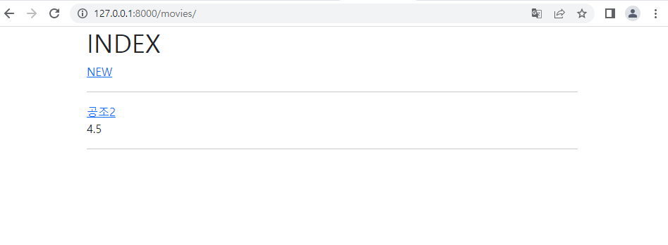
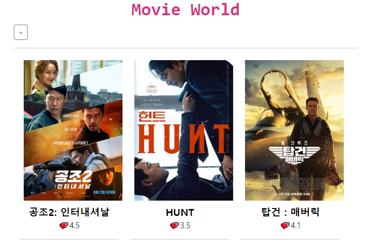
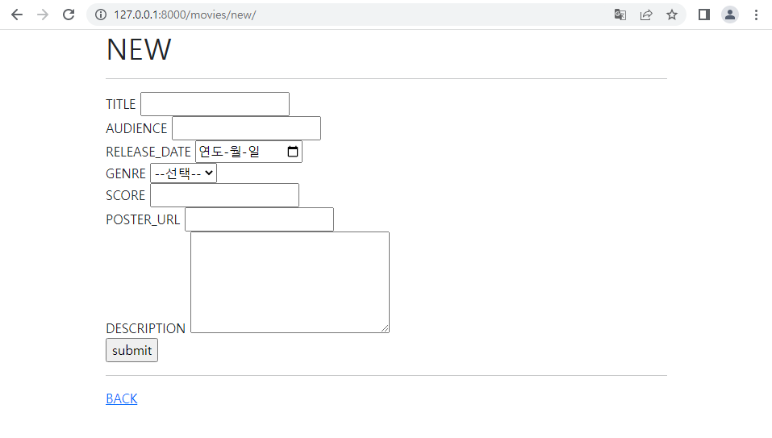
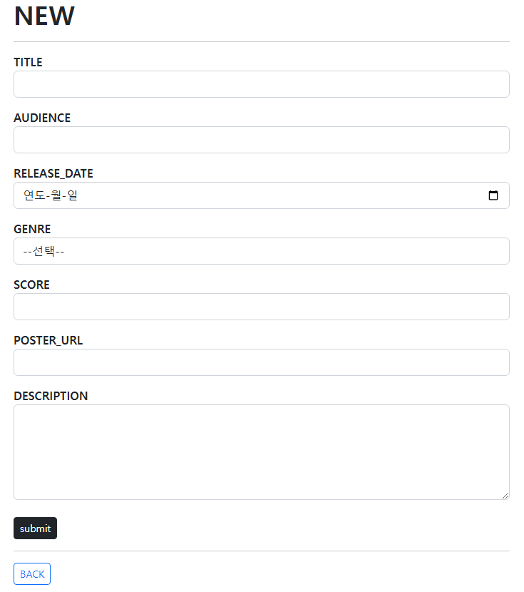
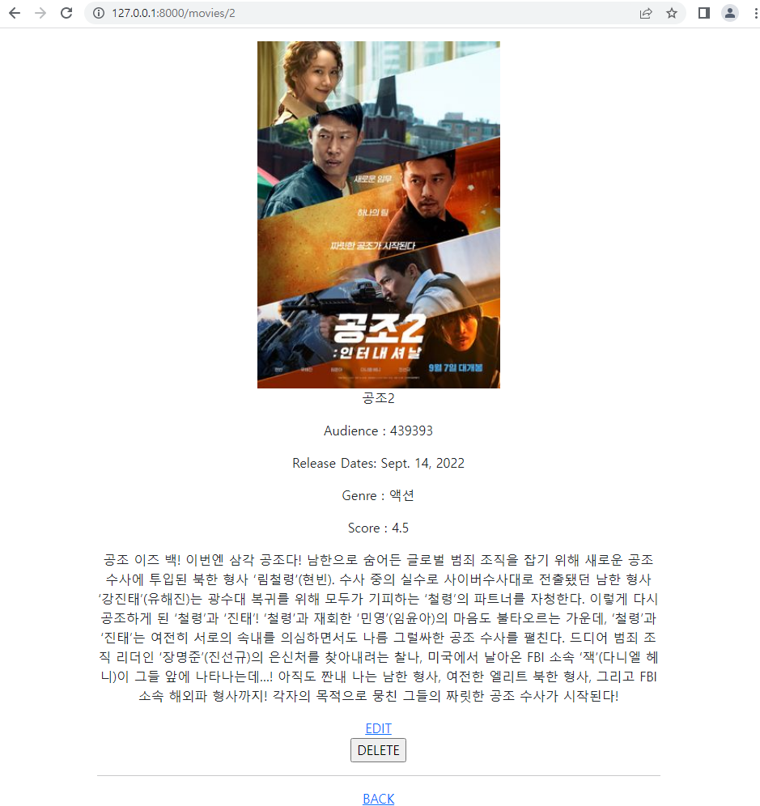
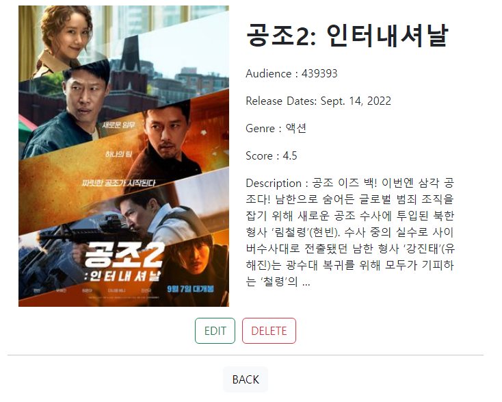
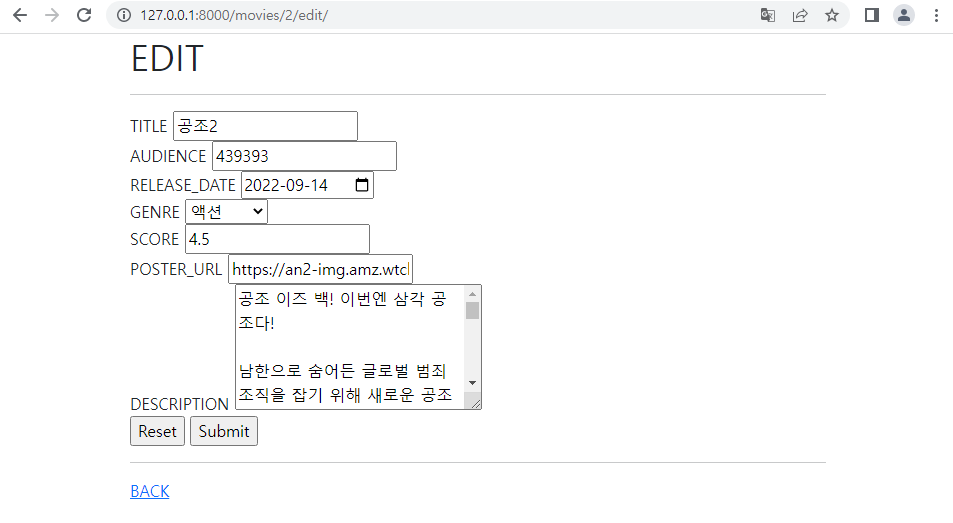
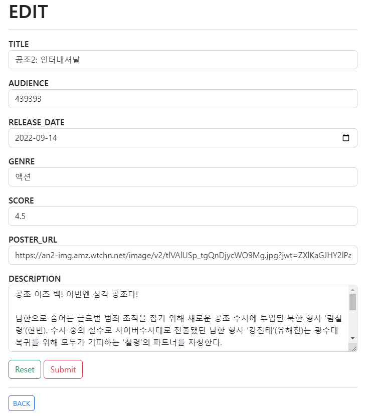

# 04_pjt 프레임워크 기반 웹 페이지 구현

#### ✨ 이번 pjt 를 통해 배운 내용

- 데이터를 생성, 조회, 수정, 삭제할 수 있는 Web application을 제작하는 방법
- Django web framework를 사용한 데이터 처리
- Django Model과  ORM에 대한 이해
- 관리자 페이지를 통한 데이터 관리

### 요구사항

- 커뮤니티 웹 서비스의 데이터 구성 단계입니다.
- 영화 데이터의 생성, 조회, 수정, 삭제가 가능한 애플리케이션을 완성합니다.
- Django 프로젝트의 이름은 **mypjt**, 앱 이름은 **movies**로 지정합니다.
- 명시된 요구사항 이외에는 자유롭게 작성해도 무관합니다.

 

### 1 . Model

####  - 요구 사항

- 정의할 모델 클래스의 이름은 Movie이며, 다음과 같은 정보를 저장합니다.

|    필드명    | 데이터 유형 |    역할     |
| :----------: | :---------: | :---------: |
|    title     | varchar(20) |  영화 제목  |
|   audience   |   integer   |   관객 수   |
| release_date |    date     |   개봉일    |
|    genre     | varchar(30) |    장르     |
|    score     |    float    |    평점     |
|  poster_url  |    text     | 포스터 경로 |
| description  |    text     |   줄거리    |


#### - 코드 설명

```python
from django.db import models

# Create your models here.
class Movie(models.Model):
    title = models.CharField(max_length=20)
    audience = models.IntegerField()
    release_date = models.DateField()
    genre = models.CharField(max_length=30)
    score = models.FloatField()
    poster_url = models.TextField()
    description = models.TextField()
    
```

#### - 이 문제에서 어려웠던 점

- 필드명과 데이터 유형이 다 주어지지 않았다면 어떤 필드들이 필요할지 고민이 필요했을 것 같다.

  

### 2. URL

#### - 요구사항

- movies 앱은 다음 URL 요청에 맞는 역할을 가집니다.

| URL 패턴             | 역할                         |
| -------------------- | ---------------------------- |
| /movies/             | 전체 영화 목록 페이지 조회   |
| /movies/new/         | 새로운 영화 생성 페이지 조회 |
| /movies/create/      | 단일 영화 데이터 저장        |
| /movies/<pk>/        | 단일 영화 상세 페이지 조회   |
| /movies/<pk>/edit/   | 기존 영화 수정 페이지 조회   |
| /movies/<pk>/update/ | 단일 영화 데이터 수정        |
| /movies/<pk>/delete/ | 단일 영화 데이터 삭제        |


#### - 코드 설명

##### 1) mypjt/urls.py

```python
from django.contrib import admin
from django.urls import path, include

urlpatterns = [
    path('admin/', admin.site.urls),
    path('movies/', include('movies.urls')),
]
```

##### 2) movies/urls.py

```python
from django.urls import path
from . import views

app_name = 'movies'
urlpatterns = [
    path('', views.index, name='index'),
    path('new/', views.new, name='new'),
    path('create', views.create, name='create'),
    path('<int:pk>', views.detail, name='detail'),
    path('<int:pk>/edit/', views.edit, name='edit'),
    path('<int:pk>/update/', views.update, name='update'),
    path('<int:pk>/delete/', views.delete, name='delete'),
]
```

#### - 이 문제에서 어려웠던 점

- URL 패턴이 다 주어지지 않았더라면 어떤 경로를 만들어야 할 지 어려웠을 것이다.
- namespace에 따라 경로를 app내로 설정해주었다.
- include를 사용하여 경로 설정을 하는 방법을 조금 더 연습해야겠다.


### 3. Views.py

#### - 요구 사항

- movies 앱은 다음 역할을 가지는 view 함수를 가집니다.

| View 함수명 | 역할                                                  |
| ----------- | ----------------------------------------------------- |
| index       | 전체 영화 데이터 조회 및 index.html 렌더링            |
| new         | 장르 데이터 제공 및 new.html 렌더링                   |
| create      | 새로운 영화 데이터 저장 및 detail 페이지로 리다이렉트 |
| detail      | 단일 영화 데이터 조회 및 detail.html 렌더링           |
| edit        | 수정 대상 영화 데이터 조회 및 edit.html 렌더링        |
| update      | 영화 데이터 수정 및 detail 페이지로 리다이렉트        |
| delete      | 단일 영화 데이터 삭제 및 index 페이지로 리다이렉트    |


#### - 코드 설명

```python
from django.shortcuts import render, redirect

from movies.models import Movie

# Create your views here.
def index(request):
    movie = Movie.objects.all()
    context = {
        'movie' : movie,
    }
    return render(request, 'movies/index.html', context)

def detail(request, pk):
    movie = Movie.objects.get(pk=pk)
    context = {
        'movie' : movie,
    }
    return render(request, 'movies/detail.html', context)

def new(request):
    return render(request, 'movies/new.html')

def create(request):
    title = request.POST.get('title')
    audience = request.POST.get('audience')
    release_date = request.POST.get('release_date')
    genre = request.POST.get('genre')
    score = request.POST.get('score')
    poster_url = request.POST.get('poster_url')
    description = request.POST.get('description')

    movie = Movie(title=title, audience=audience, release_date=release_date, genre=genre, score=score, poster_url=poster_url, description=description)
    movie.save()
    return redirect('movies:detail', movie.pk)

def edit(request, pk):
    movie = Movie.objects.get(pk=pk)
    context = {
        'movie' : movie,
    }
    return render(request, 'movies/edit.html', context)

def delete(request, pk):
    movie = Movie.objects.get(pk=pk)
    movie.delete()

    return redirect('movies:index')

def update(request, pk):
    movie = Movie.objects.get(pk=pk)

    movie.title = request.POST.get('title')
    movie.audience = request.POST.get('audience')
    movie.release_date = request.POST.get('release_date')
    movie.genre = request.POST.get('genre')
    movie.score = request.POST.get('score')
    movie.poster_url = request.POST.get('poster_url')
    movie.description = request.POST.get('description')

    movie.save()

    return redirect('movies:detail', movie.pk)
```

#### - 이 문제에서 어려웠던 점

- View 또한 어떤 함수들이 필요하고, 어떤 역할을 하는지 주어지지 않았더라면 어려웠을 것 같다.
- 데이터를 받아오는 방법이 아직 익숙하지 않아 더 연습을 해야할 것 같다.
- pk 값에 따른 데이터를 처리하는 방법 또한 연습해야겠다.


### 4. Admin.py

#### - 요구사항

- 모델 Movie를 Admin site에 등록합니다.
- Admin site에서 데이터의 생성, 조회, 수정, 삭제가 가능해야 합니다.


#### - 코드 설명

```python
from django.contrib import admin

# Register your models here.
from .models import Movie

admin.site.register(Movie)
```

#### - 이 문제에서 어려웠던 점

- models를 등록하는 것을 더 연습해야지 !


### 5. Templates

#### - 요구 사항

- 사용 템플릿 목록
  1. `base.html`
  2. `index.html`
  3. `detail.html`
  4. `new.html`
  5. `edit.html`

#### - 코드 설명

##### A. base.html

-  공통 부모 템플릿
  - 모든 템플릿 파일은 `base.html`을 상속받아 사용합니다.

```django
<!DOCTYPE html>
<html lang="en">
<head>
  <meta charset="UTF-8">
  <meta http-equiv="X-UA-Compatible" content="IE=edge">
  <meta name="viewport" content="width=device-width, initial-scale=1.0">
  <link href="https://cdn.jsdelivr.net/npm/bootstrap@5.2.0-beta1/dist/css/bootstrap.min.css" rel="stylesheet" integrity="sha384-0evHe/X+R7YkIZDRvuzKMRqM+OrBnVFBL6DOitfPri4tjfHxaWutUpFmBp4vmVor" crossorigin="anonymous">
  <title>Document</title>
</head>
<body>
  <div class="container">
    
    
  </div>
  <script src="https://cdn.jsdelivr.net/npm/bootstrap@5.2.0/dist/js/bootstrap.bundle.min.js" integrity="sha384-A3rJD856KowSb7dwlZdYEkO39Gagi7vIsF0jrRAoQmDKKtQBHUuLZ9AsSv4jD4Xa" crossorigin="anonymous"></script>
</body>
</html>
```

#### - 이 문제에서 어려웠던 점

- X


##### B. index.html

- "전체 영화 목록 조회 페이지"
  - 데이터베이스에 존재하는 모든 영화의 목록을 표시합니다.
  - 적절한 HTML 요소를 사용하여 영화 제목 및 평점을 표시하며, 
    제목을 클릭 시 해당 영화의 상세 조회 페이지(`detail.html`)로 이동합니다.

```django



  <h1>INDEX</h1>
  <a href="">NEW</a>
  <hr>
  
    <a href="">{{ movie.title }}</a>
    <p>{{ movie.score }}</p>
    <hr>
  

```

#### - 이 문제에서 어려웠던 점

- namespace 를 고려한 경로 설정 방법이 아직 익숙치 않아 빠르게 작업하기 어려웠다.


##### C. detail.html

- "영화 상세 정보 페이지"
  - 특정 영화의 상세 정보를 표시합니다.
  - 해당 영화의 수정 및 삭제 버튼을 표시합니다.
  - 전체 영화 목록 조회 페이지(`index.html`)로 이동하는 링크를 표시합니다.

```django



  <div class="text-center">
    
    <p>{{ movie.title }}</p>
    <p>Audience : {{ movie.audience }}</p>
    <p>Release Dates: {{ movie.release_date }}</p>
    <p>Genre : {{ movie.genre }}</p>
    <p>Score : {{ movie.score }}</p>
    <p>{{ movie.description }}</p>
    <a href="">EDIT</a>
    <form action="" method="POST">
        
        <input type="submit" value = "DELETE">
    </form>
    <hr>
    <a href="">BACK</a>
</div>

```

#### - 이 문제에서 어려웠던 점

- delete 를 form 을 사용하여 POST  방식으로 받아와 처리하는 것이 어렵다.
- 경로를 설정할 때 pk 값을 넣는 것 또한 아직 헷갈린다. 


##### D. new.html

- "영화 생성 페이지"
  - 특정 영화를 생성하기 위한 HTML form 요소를 표시합니다.
  - 작성한 정보는 제출(submit)시 단일 영화 데이터를 저장하는 URL로 요청과 함께 전송됩니다.
  - 전체 영화 목록 조회 페이지(`index.html`)로 이동하는 링크를 표시합니다.

```django



  <h1>NEW</h1>
  <hr>
  <form action="" method="POST">
    
    <div>
        <label for="title">TITLE</label>
        <input type="text" id="title" name="title">
    </div>
    <div>
        <label for="audience">AUDIENCE</label>
        <input type="text" id="audience" name="audience">
    </div>
    <div>
        <label for="release_date">RELEASE_DATE</label>
        <input type="date" name="release_date">
    </div>
    <div>
        <label for="genre">GENRE</label>
        <select name="genre" id="{{ movie.genre }}">
            <option value="선택">--선택--</option>
            <option value="액션">액션</option>
            <option value="범죄">범죄</option>
            <option value="코미디">코미디</option>
            <option value="로맨스">로맨스</option>
            <option value="스릴러">스릴러</option>
            <option value="공포">공포</option>
            <option value="멜로">멜로</option>
            <option value="뮤지컬">뮤지컬</option>
            <option value="음악">음악</option>
            <option value="기타">기타</option>
        </select>
    </div>
    <div>
        <label for="score">SCORE</label>
        <input type="text" name="score" name="score">
    </div>
    <div>
        <label for="poster_url">POSTER_URL</label>
        <input type="text" id="poster_url" name="poster_url">
    </div>
    <div>
        <label for="description">DESCRIPTION</label>
        <textarea name="description" id="description" cols="30" rows="5"></textarea>
    </div>
    <input type="submit" value="submit">
  </form>
  <hr>
  <a href="">BACK</a>


```

#### - 이 문제에서 어려웠던 점

- form을 사용해서 url 경로 설정을 통해 data를 create 해주는 방식이 어렵다.
- html의 다양한 input 방식이 기억이 나지 않아 찾아보았다.


##### E. edit.html

- "영화 수정 페이지"
  - 특정 영화를 수정하기 위한 HTML form 요소를 표시합니다.
  - HTML input 요소에는 기존 데이터를 출력합니다.
  - Reset 버튼은 사용자의 모든 입력을 초기 값으로 재설정 합니다.
  - 작성한 정보는 제출(submit)시 단일 영화 데이터를 수정하는 URL로 요청과 함께 전송됩니다.
  - 영화 상세 정보 페이지(`detail.html`)로 이동하는 링크를 표시합니다.

```django



  <h1>EDIT</h1>
  <hr>
  <form action="" method="POST">
    
    <div>
        <label for="title">TITLE</label>
        <input type="text" id="title" name="title" value="{{ movie.title }}">
    </div>
    <div>
        <label for="audience">AUDIENCE</label>
        <input type="text" id="audience" name="audience" value="{{ movie.audience }}">
    </div>
    <div>
        <label for="release_date">RELEASE_DATE</label>
        <input type="date" name="release_date" value="{{ movie.release_date|date:'Y-m-d' }}">
    </div>
    <div>
        <label for="genre">GENRE</label>
        <select name="genre" id="genre" value="{{ movie.genre }}">
            <option value="선택">--선택--</option>
            <option value="액션"  selected  >액션</option>
            <option value="범죄"  selected  >범죄</option>
            <option value="코미디"  selected  >코미디</option>
            <option value="로맨스"  selected  >로맨스</option>
            <option value="스릴러"  selected  >스릴러</option>
            <option value="공포"  selected  >공포</option>
            <option value="멜로"  selected  >멜로</option>
            <option value="뮤지컬"  selected  >뮤지컬</option>
            <option value="음악"  selected  >음악</option>
            <option value="기타"  selected  >기타</option>
        </select>
    </div>
    <div>
        <label for="score">SCORE</label>
        <input type="text" name="score" name="score" value="{{ movie.score }}">
    </div>
    <div>
        <label for="poster_url">POSTER_URL</label>
        <input type="text" id="poster_url" name="poster_url" value="{{ movie.poster_url }}">
    </div>
    <div>
        <label for="description">DESCRIPTION</label>
        <textarea name="description" id="description" cols="30" rows="5">{{ movie.description }}</textarea>
    </div>
    <input type="reset" value="Reset">
    <input type="submit" value="Submit">
  </form>
  <hr>
  <a href="">BACK</a>

```

#### - 이 문제에서 어려웠던 점

- date 설정할 때 받아온 값을 저장하여 나타내는 것이 어려웠다.

- input의 select 에서 저장한 값을 edit 할 때 저장된 값으로 나타내는 것이 어려웠다.

- 위 사항은 if 문 외에도 가능한 방법이 있을 것 같아서 더 공부해보아야겠다.

  

---

### ✔ " 전체 영화 목록 조회 페이지 "



---

### ✔ " 영화 생성 페이지 "





---

### ✔ " 영화 상세 정보 페이지 "





---

### ✔ " 영화 수정 페이지 "






---


### 후기

- 직접 Django frame work를 활용하여 웹페이지를 제작해보니 더욱 개발에 흥미가 느껴졌다.
- 다양한 error와 직접 마주하며 error 처리 방법에 대해 고민하고 찾아보며 해결해 나갔는데, 답답하기도 하면서 어떤 부분 때문에 안되는지 고민하는 과정이 즐거웠다.
- 웹사이트에서 각 html 문서들이 어떤 방식으로 연결되는지 알게 되었다.
- Models 를 설정하고, Data를 받아와 어떻게 다루는지 조금 알게되었고 Data 쪽도 공부를 더 해야겠다는 생각이 들었다.
